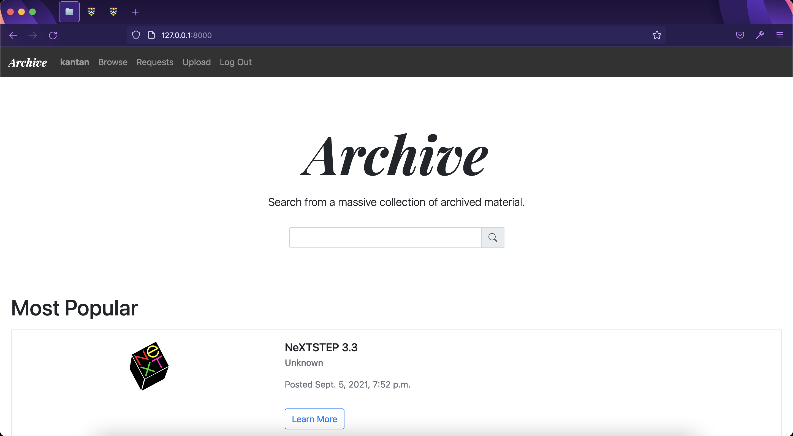

# Archive

Home Page on Desktop             |  Home Page on Mobile
:-------------------------:|:-------------------------:
  |  

Browse Page on Desktop             |  Browse Page on Mobile
:-------------------------:|:-------------------------:
  |  

Archive is a digital library that offers unhindered access to a rich collection of obsolete applications, multimedia, technical manuals and more, as well as the feature to upload legacy content in an effort to promote the spirit of software preservation.

## Distinctiveness & Complexity

The reason I decided to build a digital software library is simple: So much of our history lies in our past. By providing an open software library accessible by anyone around the globe, we can essentially create a hub of information which provides future generations the opportunity to learn about how far the computer industry has come since its early days. Another prime benefit that comes from the archive is compatibility for older machines that are no longer supported by modern operating systems. With the availability of a large number of software for these outdated systems on an organized platform, they can continue seeing daily use for the forseeable future and narrow the gap between older hardware and newer software.

The project is completely distinct in the sense that although it draws from concepts taught in the course, Archive revolves around two unique features: Download & Upload. While it may bear resemblance to Project 1 "Wiki", the latter is concerned with storing entries with information that does not extend beyond text. Archive however, focuses on storing files and all the relevant information associated with it. This may include history behind programs, supported system requirements, images & videos essential to computer history and other noteworthy details. 

Archive introduces a new level of complexity in terms of design and functionality. The download and upload feature makes use of Django's FileResponse and FileUpload methods tied to Models. Coupled with its beautiful design theme, Archive offers a seamless experience for users to fully access information as part of the primary development goal.

## Features

The salient features of Archive are as follows:

* **Browse**: Users can freely switch between different marked categories with the use of a dock to find all resources under a specified category. The dock has been designed with convenience in mind and gives power to the user to easily switch between different categories.

* **Resource Page**: Each resource(entry) has its own page where users can view information about that particular Resource. The description uses the python library `markdown2` to render its contents to make it easier for the author of that resource to highlight relevant points about it.

* **Edit Resource**: The author of a resource can edit its respective information to be more up-to-date and precise as more information pertaining to that resource is made available or to correct any previous errors during the initial resource creation process.

* **Download**: On the entry page of each resource, users can download the corresponding file of that resource to their own system for use. It makes use of Django's FileResponse method and increments the download count for that resource.

* **Comments**: Each resource also has a comments section for users who are logged in to post their thoughts about it or to ideally discuss things about the resource in question. 

* **Upload**: Users who are logged in can upload a resource of their own onto the Archive for other users to benefit from. When a user clicks on the upload tab on their navbar, they are taken to a page with an upload form. This feature makes use of Django's Model FileField to tie the File to the model and also uses a ModelForm to make it even easier to save uploaded resource files to disk under the 'resources' folder.

* **Search**: This feature allows users to easily look up a certain resource on the Archive. Using the search bar if a user were to look up a certain keyword, all relevant search results would be neatly returned and if no matches were found, it asks the user to check their search terms and try again. Should the user have typed in the exact name of the resource, they will be taken directly to the resource page. This feature makes use of Django's name__contains operation for models.

* **Requests**: In an instance where a certain piece of software isn't available on the Archive, users can request other users to possibly upload a copy for archival reasons. On the requests page, all requests that have received support(backing) by more than 25 users are considered to be "high priority requests", those with support from over 15 users are considered to be "medium priority requests" and those with support less than 15 users are considered "low priority requests". This ensures that users are always on the look out for possible copies of software that need to be archived on a priority basis.
**Note: The breakpoints for priority requests are flexible and can be altered accordingly for real-use cases.**

* **Most Popular**: Each resource has a download count that is incremented whenever a user downloads a file for the corresponding resource. Resources with over a 100 downloads are displayed in the index page of the site for visiting users to see. 
**Note: The breakpoint (100 in this case) for resource download counts are flexible and can be altered accordingly for real-use cases.**

* **Profile**: Every user on the Archive has a profile summarizing whatever resources they have uploaded and their join date. For an administrator(superuser) on the archive, they have a badge displaying their status for other users to know.

* **Paginator**: Pagination was expressly offered **only** on the requests page due to the forum-like nature of this section where having pagination would not only make sense but allow users to quickly cycle through requests.

* **Mobile Responsive**: Archive has been built from the ground-up to be compliant with mobile responsiveness. (Please refer the above images to see what it looks like on mobile)

## File Structure

```
.
├── archive/
│   ├── static/archive/
│   │   ├── dock.js
│   │   ├── favicon.ico
│   │   ├── open_request.js
│   │   ├── res_edit.js
│   │   ├── revoke.js
│   │   ├── styles.css
│   │   └── support.js
│   │
│   ├── templates/
│   ├── forms.py
│   ├── models.py
│   └── views.py
│
├── capstone/
│
├── md_screenshots/
├── manage.py
├── README.md
└── requirements.txt
```

**Files of Interest include**:

* `dock.js` - Handles operations related to switching between various categories and using AJAX to fetch models for the category as well as the creation of new elements to display the information fetched.

* `favicon.ico` - Icon for the Archive.

* `open_request.js` - Opens a new request by a user for something to be archived on the site.

* `res_edit.js` - Opens the Edit form for the author of a resource to edit that resource and also fetches information via AJAX.

* `revoke.js` - Revokes a user's support for a particular request.

* `styles.css` - CSS Stylesheet for the Archive.

* `support.js` - Raises support from a user for a particular request.

* `forms.py` - Contains the primary ModelForm definitions. This form is utilized to save form data as a Resource Model instance and also ties the file to the resource during creation.

* `models.py` - Contains Model definitions.

* `views.py` - Main entry point of the Archive web application.

## Requirements

Please see the requirements.txt file.

## How to build Archive

Archive can be simply built by executing the following commands in the top-level directory of capstone:

```python3 manage.py makemigrations archive```

```python3 manage.py migrate archive```

## Final Note

Last but not the least I would like to convey my heartfelt thanks to instructor, Brian Yu for the concise lectures as well as the CS50 staff for taking the time and having the patience to go through and grade all of my project submissions. When I first began CS50W in early 2020 amidst troubled times, I wasn't aware of the tremendous journey that awaited me and fast forward to a year later in September 2021, I'm handing in my final project. All I can say is that taking CS50 has been the best decision in my life and with everything I've learnt so far, I feel confident enough to embark on a new chapter of my career.

Thank You.